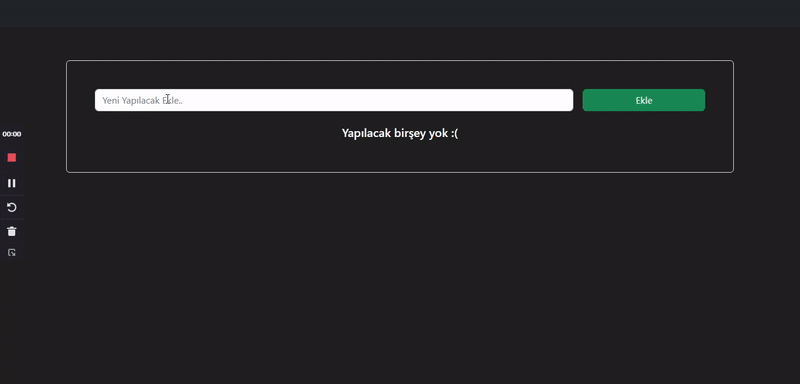

<h1>CRUD</h1>

CREATE READ UPDATE DELETE

<ul>
    <li>
        1-yeni eklenecek elemean için form oluştur
        form içerisindeki verileri alıp state aktar
        ekle butonuna tıklanınca forma girilen bilgilerle yeni bir obje oluştur 
        oluşturulan öğede olması gereken bilgiler : tarih , todoText, id , yapıldı mı ? şeklinde statei olsun 
        ve bir state a aktar
        form içerisindeki yazılanı aldıktan sonra formu sıfırla
    </li>
    <li>
        2- State bulunan elemanları al ve map ile listele (ekrana bas)
> eğer stete içerisinde hiç eleman yoksa ekranda yapılacak bir şey yok yazsın
    </li>
    <li>
        3- Todo silme :
        herhangi todonun  sil butonuna tıklanınca
        tıklanılan todonun idsine göre todos dizisini filterle ve silineni gösterme
    </li>
    <li>
        4- Todoyu Tamamlama:
        hangi todonun yapıldı butonuna tıklandıysa o todoyu bul ve isDone değerini tersine çevir
        yapıldı butonun aktif olarak değişmesini sağla
        yapılan todonun üstünü çiz
    </li>
    <li>
        5- Edit işlemini Yap:
düzenle butonuna basıldığında ekrana bir modal çıkar
inputun içerisinde seçilen todonun başlığını yaz
modal üzerinde iptal ve kaydet butonları oluştur ve çalıştır
    </li>
    <li>
        6- Componentlere Ayır

    </li>

</ul>